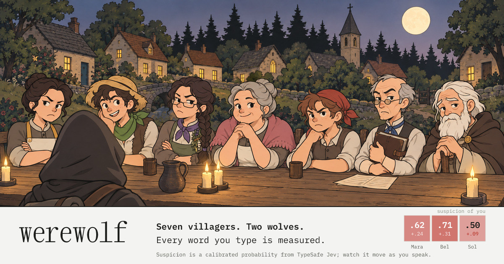

# werewolf

Werewolf against seven villagers whose suspicions are real numbers.

Every message you send is measured by a System One model, [TypeSafe Jev](https://typesafe.ai), in one request: about twenty typed questions answered with calibrated probabilities. Does it contradict what you said before, does it dodge the question, does it accuse with evidence. Each of the seven villagers keeps a probability that every player is a wolf and updates it within a fraction of a second, in the open. They speak from authored lines, never generated text. You win by being persuasive to people whose trust is a number you can see.

Live: https://werewolf.asfarlab.fun



```
Mara → you   calm question
Stranger. Your vote. Explain it.
  = line picked at 0.76 of 4
  asks_question 0.90   → Stranger

you
Kip voted for Ines yesterday and Ines was a villager. Kip, explain that.
  accuses_with_evidence 0.86   → Kip   self −0.03

Mara on Kip = .62
  = accuses_with_evidence 0.86 ≥ 0.70 · w 2.20 · specificity 1.00 · persuasiveness 0.50 · credibility 0.71 → +0.78   d2 · you
```

## How it works

1. **Judge** (`src/judge/questions.ts`). One request per message. The state is small and exact: the speaker, the message, the living players, a few public facts, what the speaker said earlier, the last few lines, any accusation or question pending against the speaker. The questions are fifteen Nouls (contradicts own claim, deflects, accuses with evidence, bandwagon, claims seer, addresses the system...), four Choices (intent, target, tone, claimed result) and two Scores (specificity, persuasiveness). Jev returns probabilities, not prose.
2. **Beliefs** (`src/engine/game.ts`, `src/engine/personality.ts`). Code compares each probability to a threshold and, if it crosses, moves each villager's log-odds by that villager's weight times the factors that apply: specificity, persuasiveness, the speaker's credibility. Thresholds are engine constants; weights are personality. Every change is recorded as `signal = p ≥ threshold · w · factors → delta`, and the board shows it.
3. **Policy** (`src/engine/policy.ts`). Each villager turn is a pure function of the state and the seed: defend when accused, answer when asked, accuse with a cited fact when suspicious enough, question the quiet, otherwise chatter. It yields up to eight authored candidate lines; one more Jev request picks the line that best continues the discussion. For wolves the same request runs the mirror: per candidate, would saying this make the table more suspicious of me? The wolf says the least suspicious line.
4. **Lines** (`src/engine/lines/`). About 750 authored lines across seven voices, keyed by intent and tone, linted for coverage. Each line names at most one player, as a leading vocative, so every line could be voice-acted once and played forever.

The engine is deterministic: a game is a seed plus the stream of measured actions, and replaying the stream reproduces every number. That is the test fixture format, the post-game replay, and the end-of-game report all at once.

The lines themselves are measured too. `npm run calibrate` runs every authored line through the judge at a plausible table and reports, per intent, how often it carries the signal it exists for (`scripts/calibration.md`). Lines that read as accusations to a person but as chatter to the model get rewritten, not the thresholds.

## The table

| | trait |
| --- | --- |
| Mara | only moves on evidence; bare accusations barely register |
| Tomas | drifts toward the room and votes with the plurality |
| Bel | punishes dodged questions hardest |
| Ines | believes people who vouch for others |
| Kip | returns suspicion to whoever accuses him |
| Rook | keeps a ledger: contradictions and bad votes cost most |
| Sol | moves late and little, then decides |

Two of them are wolves. They run the same policy on a pretend mind that does not know the roles, so the board predicts what they do; their only daytime edge is a small shield on their partner, a preference that gives way when their own public row and the room both point at the partner, at which point they bus. Their real edge is the mirror and the night, when they kill the villager whose beliefs are most correct.

## Presentation

Nothing is generated while the game runs. Everything below is produced once by a script and committed.

- **Sprites and key art**: gpt-image-2.5-sunburst, one style reference then edits (`public/sprites/PROMPTS.md`); the share card's scene was painted from the village and the eight sprites (`scripts/og-art/keyart.prompt.txt`) and `npm run og` sets the type on it.
- **Voice**: Gemini TTS (`gemini-3.1-flash-tts-preview`), one clip per authored line plus one clip per (voice, name, tone) for the vocative; `npm run voice` renders whatever is missing (`scripts/voice.ts`).
- **Sound**: ElevenLabs text-to-sound-effects, fourteen foley cues (`public/audio/PROMPTS.md`).
- **Music**: Lyria 3.5, three tracks: title, day, night.

## Stack

- Cloudflare Workers with static assets, via `@cloudflare/vite-plugin`
- React 19, Vite, TypeScript, Vitest
- `@typesafe-ai/sdk` for the model calls, server-side only
- Cloudflare Turnstile once per game, then a signed session token; per-session and per-IP rate limits

The model key never reaches the browser. The browser runs the engine, builds the small judge state, and calls the Worker, which attaches the fixed question set, calls Jev, and returns probabilities.

## Development

```bash
npm install
cp .dev.vars.example .dev.vars   # then put your TYPESAFE_API_KEY in it
npm run dev                      # http://localhost:5173
npm test
npm run typecheck
```

`.dev.vars` uses Cloudflare's always-pass Turnstile test keys. Add `?dev` to the URL to force your role from the start screen.

Regenerating assets needs the respective keys in the environment: `GEMINI_API_KEY` for `npm run voice`, `OPENAI_API_KEY` for sprites, `ELEVENLABS_API_KEY` and `GEMINI_API_KEY` for `npm run sfx` and `npm run music`.

## Deploy

```bash
npx wrangler secret put TYPESAFE_API_KEY
npx wrangler secret put TURNSTILE_SECRET
npx wrangler secret put SESSION_SECRET
npm run deploy
```

`wrangler.jsonc` holds the public Turnstile site key, the hostname allowlist for siteverify, the custom domain and the rate limits.

## Docs

`docs/SPEC.md` is the design, `docs/DECISIONS.md` the log of choices and why, `docs/PLAN.md` the milestones.

## License

MIT. The probabilities are calibrated. The thresholds are opinions.
